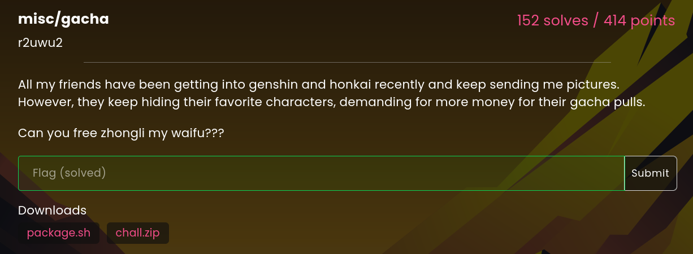
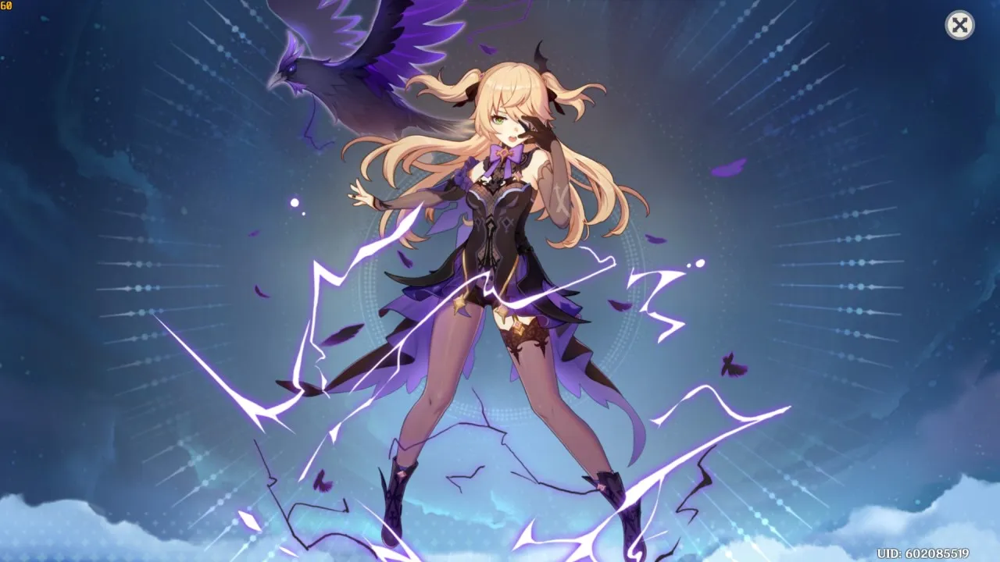

# misc/gacha


<sub><sup>(No way, Zhongli spotted outside Kerckhoff Hall??)</sup></sub>

Here's the challenge description:


We're given the two files ``package.sh`` and ``chall.zip``. Unzipping ``chall.zip`` gives three images, which are ``fiscl.png``, ``owo.png``, and ``uwu.png`` respectively:



So ``uwu.png`` and ``owo.png`` are literally useless to us as of right now, but let's take a look at the other file.

``package.sh`` contains the following:
```shell
#!/bin/sh
dd if=/dev/urandom ibs=1 count=128 > secret.key
rm -rf chall
mkdir -p chall
cp img/fiscl.png chall/

# add flag to uwu
magick img/uwu.png \
    -weight 50000 -fill red -pointsize 96 \
    -draw "text 50,540 '`cat flag.txt`'" \
    PNG24:flag.png

magick img/owo.png -encipher secret.key chall/owo.png
magick flag.png -encipher secret.key chall/uwu.png
rm flag.png

rm -f chall.zip
zip -9r chall.zip chall/
```
Let's walk through this bit by bit. The first line creates a file called ``secret.key`` that's just a large random number. Then, the directory ``chall`` is removed and re-created in the event that there was anything there to begin with, such that it is now an empty directory. Next, ``fiscl.png`` is copied into ``chall``. This is where stuff gets good.

Searching for ``magick`` returns ImageMagick, a command-line image editor, which we can install quickly. Then, we can analyze the remaining code. It appears to be taking ``img/uwu.png`` (note that this is not the same file as ``chall/uwu.png``) and drawing text over it, notably, it ``cat``s out ``flag.txt``, presumably onto the image. Therefore, we just need to find what ``flag.png`` looks like, and we'll be done.

With that goal in mind, we look through the next commands. ImageMagick provides an ``-encipher`` option, and the documentation says that it uses the AES cipher in Counter mode. It also has a corresponding ``-decipher`` option, which looks like something we'll have to call. The two enciphering lines take ``img/owo.png`` and ``flag.png``, and encipher them with the exact same passphrase to get ``chall/owo.png`` and ``chall/uwu.png``. Finally, we delete ``flag.png`` and zip up ``chall``.

Simply using the images as passphrases for ``-encipher`` doesn't work: they contain vastly different data from ``secret.key`` and all that you get is something like this:


So I stared at this challenge for two whole hours because I kept trying different combinations of images and passphrases for ``-encipher`` and ``-decipher``. I got nowhere sadg.

Somewhere down the line, I realized that if I pass an enciphered image back through encipiher with the same key, I get the same image back. That's just AES at work.

That didn't really help me too much, so I went to sleep at 4 AM.

The next day, my teammates and I were thinking that we could check the image metadata to see if we could glean any information off of that. Fortunately, ImageMagick provides a great way to do that. I ran ``magick identify -verbose`` on both enciphered images and found that since they used the same passphrase, they also had the same AES-CTR nonce. The nonce essentially tells the AES counter where to start, so in other words, the two had the *exact same* encryption scheme, with no differences or randomization at all.

Furthermore a quick Google search about nonces in AES-CTR lead me to <a href="https://security.stackexchange.com/a/63189"> this post.</a> Through this, I learned that the AES-CTR generated a long string that was getting XOR'd with the images. Therefore, we should be able to get something close to the original images if we XOR ``chall/uwu.png`` and ``chall/owo.png``.

Our good friend ImageMagick comes to the rescue again. I tried the first result on Stack Overflow, which read
```shell
magick convert img1 img2 -fx "(((255*u)&(255*(1-v)))|((255*(1-u))&(255*v)))/255" img_out
```
Surprisingly, this did the trick and I did not need ``-decipher`` at all. Our final image was this thing:

<sub><sup>r2uwu2 I really don't know what to say to this one </sup> </sub>

It turns out that ``fiscl.png`` was just a red herring, which was fascinating, though looking back it probably should have been more obvious given that it's actually a different size from ``owo.png`` and ``uwu.png``.

Anyway, to wrap this up, we simply enter the flag ``lactf{zh0ng_l7_x_ch7ld3_b4t_w7th_x0r}``.

<sub><sup>lactf organizers zhongchi shippers real? </sup></sub>