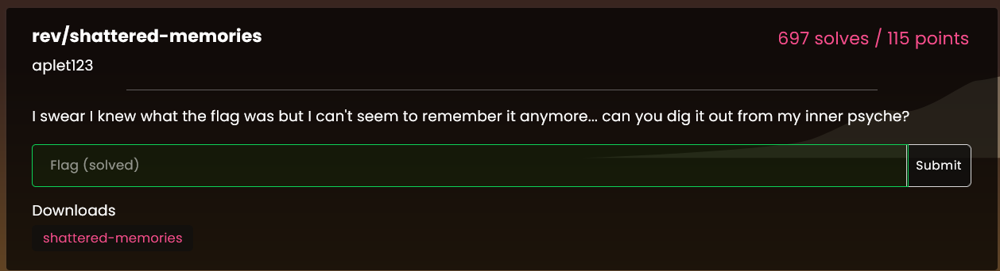
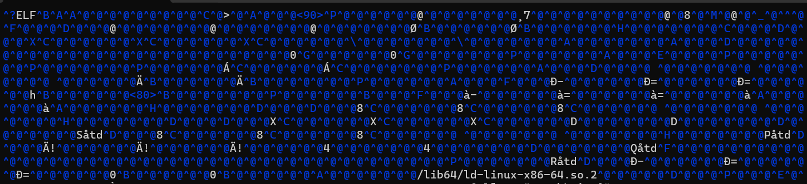
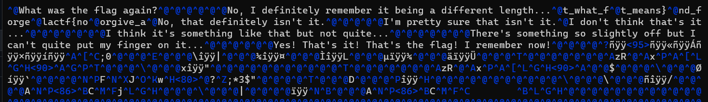

# rev/shattered-memories

Challenge description: 

It should be known that I don't know the first thing about reverse engineering binary files. And yeah, maybe the intended solve is to use Binja or Ghidra or whatever, but I don't know how to use those programs and I didn't feel like learning that during the CTF.

So instead I vimmed the binary file. And yeah, you might be thinking *Is this guy insane?* to which I'd respond, "Probably."

The lovely thing about binary files is that they are basically covered head-to-toe in "^@" when you open them:

But it turns out that if you scroll down for a bit, you start to see text that looks a little bit like a flag:

There's the ``lactf{`` and everything! Unfortuantely for us, it's out of order. But the average participant in LA CTF should probably know english, and if you don't, I suggest you learn, because what else are you doing on this writeup, so we can probably piece this together.

Using our **Superior English And Pattern Recognition Skills** (a trend among our team), we can deduce the flag of ``lactf{not_what_forgive_and_forget_means}``. Rejoice! Points be upon ye.

maybe don't do this for most rev challenges tho it doesn't work for most of them